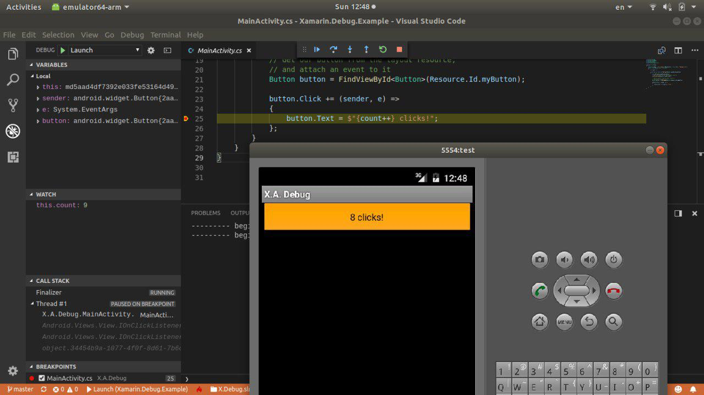

# VS Code Xamarin Debug

A simple VS Code debugger extension for the Xamarin. It's forked [Mono Debug](https://github.com/Microsoft/vscode-mono-debug) with with changes which allows you to debug Xamarin Android. 



# Help wanted

Xamarin debug is young extension, so it's a lot of things to do, and it's also important to undertand what should be done to improve extention. 

__We need your feedback__. If you found a bug, something doens't work, or setup process isn't clear enought for your, or if you just have thoughts how to improve: do not hesitate to create an issue.

__Contribution__. You can implment any issue which is labled with _Help wanted_ label. 

# Limitaion

Xamarin Debug supports only debuggin of Xamarin.Android projectes on MacOs or Ubuntu(probaly it should work on other linux distros, but nobody tested it).
Xamarin Android debugging support only one attached device, please make sure that command ```adb devices``` shows only one device in list.

# Debuggin Xamarin Android

In order to debug Xamarin.Android appliction you need to install it on device. Use msbuild target Intstall:
```bash
msbuild droid.csproj /p:Configuration=Debug /t:Install
```

After install setup debugger like in [example](https://github.com/VysotskiVadim/Xamarin.Debug.Example):
```json
{
  "name": "Debug android",
  "type": "xamarin",
  "request": "launch",
  "packageName": "com.xamarin.debugexample.x_a_debug"
}

```

# Building extension

[](https://travis-ci.org/VysotskiVadim/vscode-xamarin-debug)

Building and using VS Code xamarin-debug requires a basic POSIX-like environment, a Bash-like shell, and an installed Mono framework.

To build the extension vsix, run:
```bash
npm install
make
```

